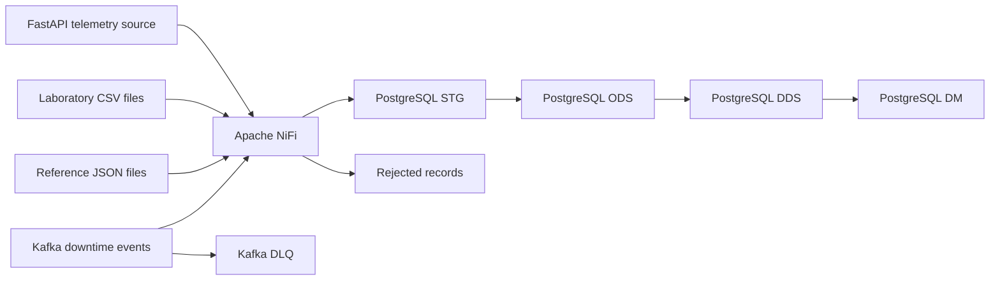

# Industrial Integration Lab

**Polymer Production Quality & Downtime**

Portfolio-grade industrial data integration project demonstrating how equipment telemetry, laboratory quality results, reference data, and downtime events can be ingested, validated, reconciled, and prepared for analysis.

The lab is designed to demonstrate the practical responsibilities of a Middle Technical Implementation Engineer: discovery, source analysis, solution design, data mapping, integration development, testing, deployment planning, troubleshooting, and operational handover.

> **Project status:** Stage 2 — Platform Foundation. Reference and telemetry
> contracts are executable, and the NiFi telemetry process group is reproducibly
> provisioned from Git.

## Business Scenario

A polymer compounding plant produces batches of granular materials on extrusion lines. Product quality depends on stable process conditions, correct raw materials, and controlled equipment operation.

Operational data is distributed across four source channels:

| Source | Format | Example data |
|---|---|---|
| Equipment telemetry API | REST / JSON | temperature, pressure, screw speed, power consumption, equipment status |
| Laboratory results | CSV | moisture, density, melt flow index, test result and specification limits |
| Equipment and material reference data | JSON files | production lines, equipment, materials and valid operating ranges |
| Downtime events | Kafka messages | downtime start, end, reason, equipment and event status |

The integration platform will connect these datasets so that production and quality teams can investigate questions such as:

- Did process deviations occur during a production batch?
- Which equipment and materials were associated with a failed laboratory result?
- How much downtime occurred by line, equipment, and reason?
- Were all expected source records loaded exactly once?
- Can rejected or missed data be safely corrected and replayed?

## Planned Solution



The complete environment is intended to run locally through Docker Compose and contain:

- a FastAPI application that simulates the telemetry source system;
- Apache NiFi for ingestion, validation, routing, retry, and failure handling;
- a single-broker Kafka setup for downtime-event delivery and replay exercises;
- PostgreSQL organized into STG, ODS, DDS, and DM layers;
- separate audit, control, reconciliation, and rejected-record structures;
- structured logs and correlation IDs for end-to-end traceability.

## Target Capabilities

The implementation will demonstrate:

- incremental data loading;
- idempotent processing and duplicate handling;
- safe reruns without double-counting;
- schema and business-rule validation;
- data-quality checks and source-to-target reconciliation;
- NiFi provenance, back pressure, retry, and failure routes;
- Kafka consumer recovery, DLQ handling, and controlled replay;
- source-to-target mapping and data lineage;
- operational troubleshooting using logs, audit data, and correlation IDs;
- UAT, rollout, rollback, and support documentation.

## Data Platform Layers

| Layer | Responsibility |
|---|---|
| **STG** | Preserve received source data and ingestion metadata with minimal transformation |
| **ODS** | Store validated, standardized, and deduplicated operational records |
| **DDS** | Represent conformed dimensions and facts at explicitly defined grains |
| **DM** | Provide focused analytical datasets for quality and downtime analysis |

Invalid records will not be silently discarded. They will be stored separately with the original payload, validation reason, source metadata, correlation ID, and processing timestamp.

## Implementation Lifecycle

The project is organized into five stages:

1. **Discovery and Design** — business scope, requirements, source contracts, mappings, architecture, data model, and acceptance criteria.
2. **Platform Foundation** — Docker Compose, PostgreSQL, Kafka, NiFi, and source simulation.
3. **Integration Implementation** — ingestion flows, DWH layers, validation, idempotency, and error handling.
4. **Verification and Operations** — automated checks, reconciliation, UAT, replay, incident cases, and runbook.
5. **Portfolio Packaging** — architecture diagrams, screenshots, reproducible demo, and final documentation.

## Scope Boundaries

This is an integration and data-engineering laboratory, not a full manufacturing execution system.

The project intentionally excludes:

- frontend development;
- production planning and order management;
- operator and shift management;
- recipe lifecycle management;
- predictive maintenance and machine learning;
- Kubernetes and cloud infrastructure;
- a BI platform;
- complex Kafka platform administration;
- microservice architecture.

Kafka is used only at the application level to demonstrate event consumption, duplicate handling, failure isolation, and replay.

## Planned Evidence

The completed portfolio project will include:

- documented discovery decisions and assumptions;
- functional and non-functional requirements;
- four versioned source contracts;
- source-to-target mappings and lineage diagrams;
- reproducible Docker-based deployment;
- NiFi flow documentation and provenance screenshots;
- SQL data-quality and reconciliation results;
- UAT scenarios and acceptance evidence;
- rollout and rollback checklists;
- an operational runbook;
- two documented incident investigations;
- a guided end-to-end demo.

## Current Work

Reference ingestion and the telemetry source/database contracts are implemented.
The current delivery adds the NiFi telemetry process group that reads the API,
calls the page-level PostgreSQL contract, and persists its composite watermark.

## Technology Stack

- **API:** Python, FastAPI
- **Integration:** Apache NiFi
- **Event transport:** Apache Kafka, single broker
- **Database:** PostgreSQL
- **Runtime:** Docker Compose, Linux containers
- **Documentation:** Markdown, Mermaid diagrams

## Implemented Vertical Slices

### Reference data

The current slice loads one plant, one line, one extruder, two materials, and
three production batches from JSON into PostgreSQL. It preserves the raw record,
audits every attempt, rejects invalid records, treats an unchanged replay as a
duplicate, and exposes the initial `BATCH-003` dossier.

Prerequisites: Docker with Compose v2 and Python 3.9 or newer.

```bash
make test
make start
make verify-reference
make replay-reference
```

`make start` initializes and loads the reference files on a new PostgreSQL
volume. `make replay-reference` loads the same documents again and proves that
the ODS counts remain unchanged while duplicate attempts appear in audit.

The shell loader is a temporary contract-test adapter. The accepted target
architecture calls the same `ods.load_reference_document` function from NiFi.

Architecture decisions are recorded in [`docs/adr`](docs/adr), and the current
solution design is in [`docs/04-solution-design.md`](docs/04-solution-design.md).

### Telemetry

The FastAPI simulator exposes deterministic, paginated telemetry with timeout,
HTTP 500, and duplicate scenarios. PostgreSQL processes one API page per
transaction, validates measurements against batch and material data, preserves
rejected records, calculates deviations, advances a composite watermark, and
reconciles every page.

```bash
make start-api
make test-api
make test-telemetry-db
```

The telemetry database test proves initial acceptance, safe replay, duplicate
handling, rejection of unknown equipment, and the `BATCH-003` temperature
deviation.

### NiFi telemetry orchestration

NiFi 2.10.0 is built with a pinned PostgreSQL JDBC driver. A source-controlled
flow specification is provisioned through the REST API into a Parameter Context
and process group. API and database retries are bounded independently, and the
next page is requested only after the current database transaction succeeds.

```bash
make start-nifi
make verify-nifi
make replay-nifi
```

The first command can take several minutes while the NiFi image is downloaded.
Operational details are in
[`docs/07-runbooks/nifi-telemetry-flow.md`](docs/07-runbooks/nifi-telemetry-flow.md).
