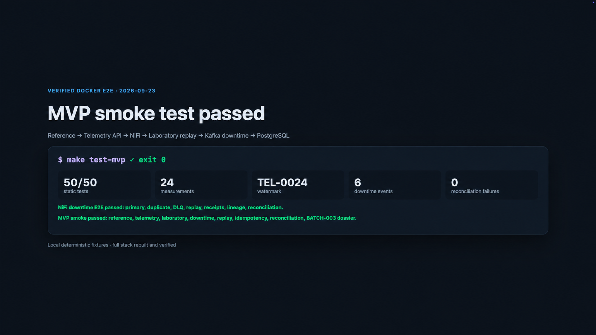
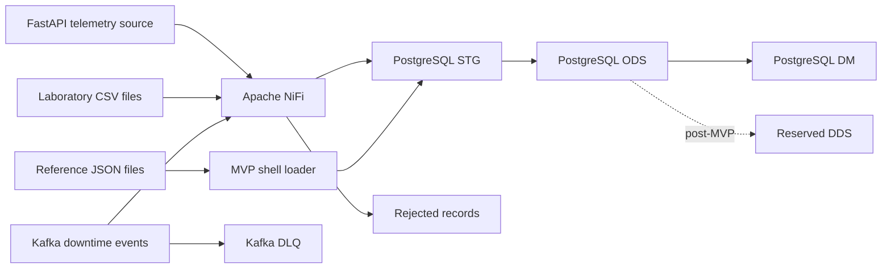

# Industrial Integration Lab

**Polymer Production Quality & Downtime**

[](https://github.com/shipaaa/industrial-integration-lab/actions/workflows/ci.yml)
[](LICENSE)
[](docs/07-runbooks/mvp-demo.md)

Portfolio-grade industrial data integration project demonstrating how equipment telemetry, laboratory quality results, reference data, and downtime events can be ingested, validated, reconciled, and prepared for analysis.

The lab is designed to demonstrate the practical responsibilities of a Middle Technical Implementation Engineer: discovery, source analysis, solution design, data mapping, integration development, testing, deployment planning, troubleshooting, and operational handover.

> **Project status:** Demo-ready MVP. All four source channels are executable,
> all three NiFi process groups are reproducibly provisioned from Git, and one
> Docker smoke test verifies the complete BATCH-003 investigation path.



## What this project proves

| Area | Demonstrated outcome |
|---|---|
| Sources | REST telemetry, laboratory CSV, reference JSON, and Kafka downtime events |
| Orchestration | Three Git-managed Apache NiFi process groups with bounded retries |
| Reliability | Watermarks, idempotency, duplicate handling, DLQ, correction replay, and reconciliation |
| Investigation | One BATCH-003 dossier links a failed lab result to a process deviation and 7 downtime minutes |
| Acceptance | One deterministic Docker command verifies the complete integration path |

## Quick start

Prerequisites: Docker Desktop with Compose v2 and Python 3.9 or newer.

```bash
cp .env.example .env
make test
make test-mvp
```

`make test` runs the fast contract suite. `make test-mvp` builds the full local
stack and exercises all four sources, replay paths, idempotency, reconciliation,
and the final investigation mart. See the
[10–15 minute demo runbook](docs/07-runbooks/mvp-demo.md) for the operator flow.

## Business Scenario

A polymer compounding plant produces batches of granular materials on extrusion lines. Product quality depends on stable process conditions, correct raw materials, and controlled equipment operation.

Operational data is distributed across four source channels:

| Source | Format | Example data |
|---|---|---|
| Equipment telemetry API | REST / JSON | temperature, pressure, screw speed, power consumption, equipment status |
| Laboratory results | CSV | moisture, density, melt flow index, test result and specification limits |
| Equipment and material reference data | JSON files | production lines, equipment, materials and valid operating ranges |
| Downtime events | Kafka messages | downtime start, end, reason, equipment and event status |

The integration platform will connect these datasets so that production and quality teams can investigate questions such as:

- Did process deviations occur during a production batch?
- Which equipment and materials were associated with a failed laboratory result?
- How much downtime occurred by line, equipment, and reason?
- Were all expected source records loaded exactly once?
- Can rejected or missed data be safely corrected and replayed?

## Architecture



The MVP environment runs locally through Docker Compose and contains:

- a FastAPI application that simulates the telemetry source system;
- Apache NiFi for ingestion, validation, routing, retry, and failure handling;
- a single-broker Kafka setup for downtime-event delivery and replay exercises;
- PostgreSQL schemas for STG, ODS, reserved DDS, and DM layers;
- separate audit, control, reconciliation, and rejected-record structures;
- structured logs and correlation IDs for end-to-end traceability.

## Demonstrated capabilities

The implementation demonstrates:

- incremental data loading;
- idempotent processing and duplicate handling;
- safe reruns without double-counting;
- schema and business-rule validation;
- data-quality checks and source-to-target reconciliation;
- NiFi provenance, back pressure, retry, and failure routes;
- Kafka consumer recovery, DLQ handling, and controlled replay;
- source-to-target mapping and data lineage;
- operational troubleshooting using logs, audit data, and correlation IDs;
- deterministic acceptance, replay, recovery, and operator runbooks.

## Data Platform Layers

| Layer | Responsibility |
|---|---|
| **STG** | Preserve received source data and ingestion metadata with minimal transformation |
| **ODS** | Store validated, standardized, and deduplicated operational records |
| **DDS** | Represent conformed dimensions and facts at explicitly defined grains |
| **DM** | Provide focused analytical datasets for quality and downtime analysis |

DDS is intentionally reserved but not populated in the MVP; the accepted path
is STG → ODS → DM so the demonstration stays focused on integration behaviour.

Invalid records will not be silently discarded. They will be stored separately with the original payload, validation reason, source metadata, correlation ID, and processing timestamp.

## Implementation Lifecycle

The project is organized into five stages:

1. **Discovery and Design** — business scope, requirements, source contracts, mappings, architecture, data model, and acceptance criteria.
2. **Platform Foundation** — Docker Compose, PostgreSQL, Kafka, NiFi, and source simulation.
3. **Integration Implementation** — ingestion flows, DWH layers, validation, idempotency, and error handling.
4. **Verification and Operations** — automated checks, reconciliation, UAT, replay, incident cases, and runbook.
5. **Portfolio Packaging** — architecture diagrams, screenshots, reproducible demo, and final documentation.

## Scope Boundaries

This is an integration and data-engineering laboratory, not a full manufacturing execution system.

The project intentionally excludes:

- frontend development;
- production planning and order management;
- operator and shift management;
- recipe lifecycle management;
- predictive maintenance and machine learning;
- Kubernetes and cloud infrastructure;
- a BI platform;
- complex Kafka platform administration;
- microservice architecture.

Kafka is used only at the application level to demonstrate event consumption, duplicate handling, failure isolation, and replay.

## Portfolio evidence

The repository includes:

- four versioned source contracts;
- source-to-target mappings and lineage diagrams;
- reproducible Docker-based deployment;
- NiFi flow documentation and provenance screenshots;
- SQL data-quality and reconciliation results;
- operational and replay runbooks;
- deterministic acceptance evidence;
- a guided end-to-end demo.

Post-MVP extensions are intentionally limited to moving the static reference
loader into NiFi, production security and observability, and a fuller DDS/BI
serving layer. They are not required for the portfolio demonstration.

## MVP status

Reference ingestion, telemetry API ingestion, versioned laboratory CSV
ingestion, and Kafka downtime ingestion are implemented. NiFi owns orchestration
for telemetry, laboratory, and downtime; the reference shell loader is the one
documented MVP limitation. PostgreSQL remains the authority for business
validation, duplicate outcomes, replay linkage, and reconciliation.

## Demo-ready acceptance

With Docker Desktop running, the single acceptance command is:

```bash
make test-mvp
```

It builds and starts the stack, provisions the flows, runs all static tests,
loads all four channels, exercises duplicate and correction replay paths, and
asserts the final BATCH-003 dossier: 24 telemetry measurements, watermark
`TEL-0024`, laboratory status `FAIL`, one temperature deviation, 7 downtime
minutes, and zero reconciliation failures. The 10–15 minute operator sequence
and recovery checks are in
[`docs/07-runbooks/mvp-demo.md`](docs/07-runbooks/mvp-demo.md).

Verified demo evidence is collected in
[`docs/08-demo-evidence.md`](docs/08-demo-evidence.md). The evidence set includes
the [NiFi process-group overview](docs/assets/demo/01-nifi-process-groups.png),
the [full MVP smoke result](docs/assets/demo/05-mvp-smoke-result.png), the
[BATCH-003 dossier](docs/assets/demo/06-batch-003-dossier.png), and the
[rejection/replay lineage](docs/assets/demo/07-rejection-replay-lineage.png).

## Technology Stack

- **API:** Python, FastAPI
- **Integration:** Apache NiFi
- **Event transport:** Apache Kafka, single broker
- **Database:** PostgreSQL
- **Runtime:** Docker Compose, Linux containers
- **Documentation:** Markdown, Mermaid diagrams

## Implemented Vertical Slices

### Reference data

The current slice loads one plant, one line, one extruder, two materials, and
three production batches from JSON into PostgreSQL. It preserves the raw record,
audits every attempt, rejects invalid records, treats an unchanged replay as a
duplicate, and exposes the initial `BATCH-003` dossier.

Prerequisites: Docker with Compose v2 and Python 3.9 or newer.

```bash
make test
make start
make verify-reference
make replay-reference
```

`make start` initializes and loads the reference files on a new PostgreSQL
volume. `make replay-reference` loads the same documents again and proves that
the ODS counts remain unchanged while duplicate attempts appear in audit.

The shell loader is a temporary contract-test adapter. The accepted target
architecture calls the same `ods.load_reference_document` function from NiFi.

Architecture decisions are recorded in [`docs/adr`](docs/adr), and the current
solution design is in [`docs/04-solution-design.md`](docs/04-solution-design.md).

### Telemetry

The FastAPI simulator exposes deterministic, paginated telemetry with timeout,
HTTP 500, and duplicate scenarios. PostgreSQL processes one API page per
transaction, validates measurements against batch and material data, preserves
rejected records, calculates deviations, advances a composite watermark, and
reconciles every page.

```bash
make start-api
make test-api
make test-telemetry-db
```

The telemetry database test proves initial acceptance, safe replay, duplicate
handling, rejection of unknown equipment, and the `BATCH-003` temperature
deviation.

### NiFi telemetry orchestration

NiFi 2.10.0 is built with a pinned PostgreSQL JDBC driver. A source-controlled
flow specification is provisioned through the REST API into a Parameter Context
and process group. API and database retries are bounded independently, and the
next page is requested only after the current database transaction succeeds.

```bash
make start-nifi
make verify-nifi
make replay-nifi
```

The first command can take several minutes while the NiFi image is downloaded.
Operational details are in
[`docs/07-runbooks/nifi-telemetry-flow.md`](docs/07-runbooks/nifi-telemetry-flow.md).

### Laboratory CSV

The laboratory slice loads versioned CSV results at file-transaction grain.
Every row is preserved in STG, validated independently, reconciled, and either
stored in ODS or routed to rejected records. ODS keeps the latest accepted
version; file repeats and stale versions cannot overwrite it.

The MVP demonstrates an invalid BATCH-003 Melt Flow Index result marked `PASS`,
then accepts version 2 marked `FAIL` and links the successful correction to the
original rejection.

```bash
make test-laboratory-db
```

After the test, `dm.dm_batch_investigation` reports laboratory status `FAIL`
for BATCH-003. The CSV contract and replay rules are documented in
[`docs/05-source-contracts/laboratory-csv.md`](docs/05-source-contracts/laboratory-csv.md).
The operator procedure is in
[`docs/07-runbooks/laboratory-csv-replay.md`](docs/07-runbooks/laboratory-csv-replay.md).

### NiFi laboratory orchestration

The source-controlled Laboratory CSV process group uses separate manual
triggers for primary ingestion and correction replay. Provisioning starts the
downstream graph but cannot load the corrected file automatically.

```bash
make start-nifi
make test-nifi-laboratory
```

The test proves the initial LAB-003 rejection, the linked version-2 replay, and
duplicate handling when the primary files are run again. Operational details
are in
[`docs/07-runbooks/nifi-laboratory-flow.md`](docs/07-runbooks/nifi-laboratory-flow.md).

### Kafka downtime events

The downtime slice runs an official single-node Kafka broker in KRaft mode and
creates primary, DLQ, replay, and processing-receipt topics. The source-controlled
NiFi process group consumes primary and replay deliveries, preserves Kafka
topic/partition/offset/timestamp, calls the PostgreSQL event transaction, and
publishes either a transactional receipt or the database business rejection to
the DLQ. Offsets are not committed by `ConsumeKafka`; `PublishKafka` acknowledges
them only after the required database outcome exists.

```bash
make test-downtime-db
make test-downtime-kafka
make test-nifi-downtime
```

The first two tests keep the database/Kafka contract independently testable with
the compatibility Python adapter. The NiFi Docker E2E is the demo path and proves
primary ingestion, duplicate handling, DLQ, bounded retries, transactional
receipts, timestamp lineage, and linked replay. After the primary load,
`BATCH-003` has 7 downtime minutes; replay closes the known BATCH-001 rejection.
Operational details are in
[`docs/07-runbooks/kafka-downtime-events.md`](docs/07-runbooks/kafka-downtime-events.md).
