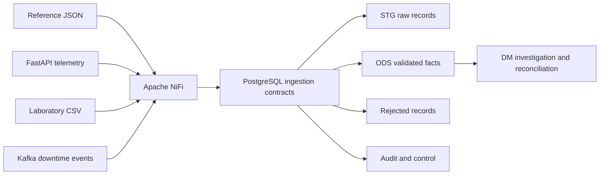

# Solution design

## MVP topology



## First vertical slice

The first executable slice loads reference documents in dependency order:

```text
plants -> lines -> equipment -> materials -> batches
```

Each record is preserved in `stg.reference_record`, then validated and upserted
into an entity-specific ODS table. A SHA-256 checksum identifies an unchanged
repeat delivery. Every attempt creates a new load run even when every record is
a duplicate.

The slice is complete when:

1. one plant, one line, one extruder, two materials, and three batches exist;
2. replay does not change ODS row counts;
3. replay is visible in audit as duplicate processing;
4. `dm.dm_batch_investigation` returns one dossier row for `BATCH-003`;
5. received equals accepted plus rejected plus duplicate for every load run.

## Deferred decisions

- NiFi version and flow deployment strategy;
- whether flow definitions are promoted through NiFi Registry or imported
  directly by a bootstrap client;

REST watermark semantics are defined in
[`ADR-002`](adr/0002-telemetry-watermark-and-pagination.md).

## Telemetry database slice

NiFi will pass one API page to `ods.load_telemetry_page`. PostgreSQL preserves
every delivery in STG, validates and deduplicates records into ODS, calculates
material-range deviations, records reconciliation, and advances the composite
watermark at the end of the transaction. The transaction boundary is defined
in [`ADR-003`](adr/0003-telemetry-page-transaction.md).
